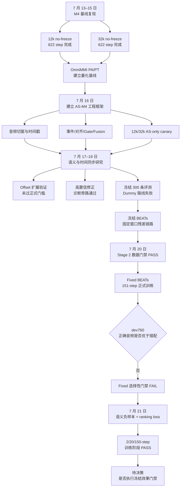
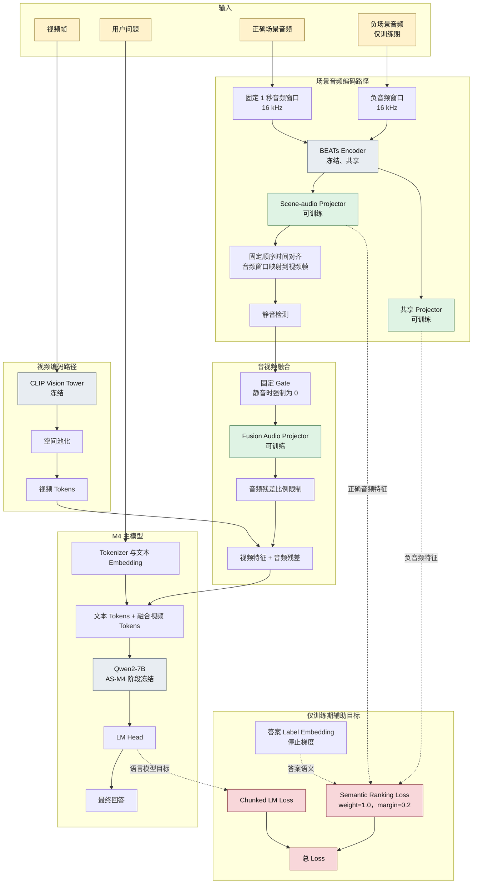
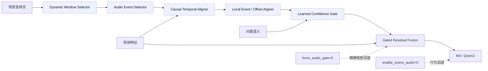

# 近几日 M4 复现与 AS-M4 场景音频增强工作汇报

汇报周期：2026-07-13 至 2026-07-21

当前状态：全部训练均已结束；当前无训练任务运行，最新 Semantic Contrast 效果门禁尚未执行

## 第 1 页：结论摘要

### 1. 总体进展

完成 M4 基线复现、AS-M4 场景音频工程链路、独立训练数据建设、Fixed BEATs正式训练以及 semantic contrast 训练。

M4 基线方面，分两种上下文长度（12k和32k）进行，均完成四卡 1 epoch 训练。12k 在 OmniMMI PT 上达到61%，接近官方 62%；32k 在 PA Accuracy 上由 19.5% 提升至 22.5%，更接近官方 25.5%，但 PT 降至 47%。因此，32k 更接近官方训练设置，但尚不能认定综合效果优于 12k。

AS-M4 方面，场景音频读取、冻结 BEATs、projector、时间建模、Gate、残差融合、训练、保存、重载和行为回退均已实现。Stage 2 数据划分和泄漏门禁通过，Fixed BEATs 也完成 151-step正式训练。但在 dev760 上，正确音频为 255/760，错配音频为 259/760，正确音频没有优于错配音频，故最终选择性门禁失败。

针对该问题，代码新增了同任务、同来源、不同媒体和不同事件标签的语义负样本，以及 margin ranking loss。该路线已经完成 `2-step -> 20-step -> 150-step`，最终`train_loss=0.336477`，目标模块权重得到有效更新，训练阶段通过。

### 2. 当前可靠结论

1. M4 12k/32k 可在四张 RTX 4090 上完成不冻结模块的完整训练。
2. AS-M4 的数据、模型、训练和回退工程闭环成立。
3. Dummy waveform statistics 不能提供可靠音频语义，会造成明显任务退化。
4. Fixed BEATs 可以稳定接入并保持静音/`gate=0` 精确回退，但固定缩放不能产生音频内容选择性。
5. Semantic ranking loss 能稳定优化 projector/fusion，但尚无最终任务证据证明它使正确音频优于错配音频。

### 3. 训练终态清单

截至 2026-07-21，本项目已经启动的训练任务均已正常结束或完成失败归因，不再有后台训练任务。
本次汇总通过进程表复核，未发现 `torchrun`、`train_mem.py`、`finetune_m4.sh` 或
`run_as_m4*` 训练进程。由于当前 Codex 沙箱无法与 NVIDIA 驱动通信，本次没有用
`nvidia-smi` 二次确认显存占用；“训练已结束”的判断依据为训练日志终态、checkpoint 完整性和
系统进程表，而不是 GPU 驱动查询。

| 训练阶段 | 最终状态 | 最终产物/结论 |
| --- | --- | --- |
| M4 12k no-freeze | 622/622，完成 | 1 epoch，loss 0.062751，作为快速开发基线 |
| M4 32k no-freeze | 622/622，完成 | 1 epoch，loss 0.091596，作为长上下文基线 |
| AS-M4 AS-only 12k/32k canary | 2/20/150-step，完成 | 数据、梯度、保存、重载和回退链路通过 |
| Dummy scene-audio | 训练/评测结束，路线停止 | 300 条评测净退化，否决该语义表示 |
| Fixed BEATs Stage 2 | 151/151，完成 | loss 0.419482；dev760 内容选择性 FAIL |
| Semantic Contrast | 2/20/150-step，完成 | loss 0.336477；训练 PASS，最终效果未评测 |

因此，“所有训练结束”不等于“所有科研假设通过”。当前不再等待训练结果，剩余工作属于冻结
checkpoint 的推理评测、误差分析和是否继续该路线的决策。

### 4. 核心未解决问题

当前唯一需要优先回答的科研问题是：**semantic contrast 的训练收益能否转化为最终回答中的
音频内容选择性？** 该 checkpoint 尚未完成 reserve326 gate 校准和新的 dev760 一次性正式门禁。

<div style="page-break-after: always;"></div>

## 第 2 页：已完成工作

### 1. 近几日工作推进结构流程图



### 2.先建立可信 M4 基线

工作起点不是直接增加音频模块，而是先解决原 M4 在本机 4090 上的显存和复现问题。通过
分块 LM loss、ZeRO-3 lowmem、稳定四卡组合和 NCCL 配置，完成：

- 12k no-freeze：622/622 step，约 11.60 小时，loss 0.062751；
- 32k no-freeze：622/622 step，约 12.04 小时，loss 0.091596；
- M4-IT 9963 条数据审计和原生视频/音频 demo 验收；
- OmniMMI PA/PT 评测，形成后续 AS-M4 必须保护的 video-only 基线。

这一阶段确定“双基线”策略：12k 用于快速开发和消融，32k 用于长上下文对照。由于 32k
在 PT 上出现退化，不能只保留 32k。

### 3.搭建 AS-M4 最小闭环

在不覆盖原 M4 checkpoint 的前提下，完成场景音频读取、重采样、滑窗、统一时间戳、事件检测、
时间对齐、置信度 Gate 和 residual fusion，并把新增链路接到视频特征进入 LLM 之前。

同时完成 Dataset/DataCollator、学习率分组、保存/重载、staged launcher 和行为/权重回退。
AS-only 的 12k/32k `2/20/150-step` canary 验证了 loss、梯度、保存和重载闭环。四卡
AS-only 改用普通 DDP，避开 ZeRO-3 对极小新增参数组的 collective mismatch。

### 4. 先做旁路诊断，再确定真实音频路线

这一阶段依次回答“音频是否有语义”“能否判断时间偏移”和“音频残差是否伤害最终生成”：

- 构建 AVUT/AVE 的 BEATs、CLIP、RGB 窗口特征和 projector 基线；
- 实现 offset scorer、offset stabilizer 和 temporal GRU 诊断；
- AVE 扩展验证得到 59.20% +/- 1.77%，未达到 70% 门槛，禁止直接接 Gate；
- 高置信选择性修正在独立测试上达到 87.04% 接受样本准确率，仅保留为诊断旁路；
- 冻结 300 条评测显示 Dummy 正确音频为 161/300，低于原始 M4 的 180/300；
- 因 Dummy 缺少语义，转向“冻结 BEATs + projector + fixed residual fusion”。

### 5. 完成真实数据和 Fixed BEATs 正式实验

完成新数据下载、替换、音轨抽取、全量解码、内容去重和泄漏审计。Stage 2 最终得到
train/dev/reserve 2430/780/326 QA、物理媒体 1000/300/120；三划分及冻结历史评测集
之间的媒体级重叠为 0，视频/音频解码率和 scene-audio 路径有效率均为 100%。

随后完成 Fixed BEATs 151-step 正式训练，并在 reserve326 校准 gate 后进行 dev760 一次性
门禁。正确音频 255/760，错配音频 259/760，说明工程回退成立但内容选择性失败。

### 6. 针对失败原因增加 Semantic Contrast

根据 Fixed 门禁暴露的问题，新增同来源、同任务、不同媒体且不同事件标签的负音频配对，并增加
margin ranking loss。完成 `2-step -> 20-step -> 150-step`，最终 loss 0.336477，
projector/fusion 权重均有有限非零更新，无 OOM、NCCL、NaN/Inf。

这一阶段只证明训练目标生效。最新 checkpoint 尚未执行 reserve326 和 dev760 冻结效果门禁，
因此当前进度停在“训练完成、最终科研假设待验证”。

### 7. 当前代码状态

当前分支为 `feat/audio-event-aligner-v1`，HEAD 为 `e343d48`。最新工作区还包含 Qwen
checkpoint 类型识别修复、对应回归测试、本汇报和 semantic-contrast 训练报告，尚未提交。

<div style="page-break-after: always;"></div>

## 第 3 页：已有实验和证据

### 1. “改动—实验—结论”证据链

| 代码/方案改动 | 实验记录 | 可靠结论 | 未解决问题 | 待决策事项 |
| --- | --- | --- | --- | --- |
| 分块 LM loss + ZeRO-3 lowmem | 12k/32k 各 622 step | 不冻结 `lm_head` 的完整训练可行 | 32k PT 退化原因未知 | 是否继续追官方全量复现 |
| Dummy scene-audio encoder | 冻结 300 条三条件评测 | waveform statistics 无可靠语义且伤害输出 | 无继续优化价值 | 已决定停止该路线 |
| 冻结 offset scorer | AVE 扩展集三 seed | 59.20% 高于随机但低于 70% 门槛 | 普通 scorer 泛化不足 | 不接正式 Gate |
| 高置信选择性修正 | 独立测试 378 条 | 覆盖 42.86%，接受准确率 87.04% | 只证明诊断旁路有效 | 是否保留为分析工具 |
| 视频窗口软/硬加权 | AVE/mixed final60 四组消融 | 不伤害基线，但没有收益 | 最终回答对加权不敏感 | 已决定不进入主路径 |
| 冻结 BEATs + projector + fusion | Stage 2 151-step + dev760 | 能稳定接入和回退，不能区分正确/错配音频 | 缺少内容选择性 | 引入 semantic ranking |
| 语义负样本 + ranking loss | 2/20/150-step | 训练稳定且目标权重有效更新 | 最终选择性尚未评测 | 是否执行冻结门禁 |

### 2. M4 基线证据

| 指标 | 官方 M4 | 12k | 32k |
| --- | ---: | ---: | ---: |
| PA Accuracy | 25.50% | 19.50% | 22.50% |
| PA Precision | 未公布 | 29.29% | 34.71% |
| PA IoU | 未公布 | 13.77% | 14.53% |
| PT Accuracy | 62.00% | 61.00% | 47.00% |

证据支持：12k 的 turn-taking 能力接近官方；32k 的 PA 更好，但 PT 显著下降。当前不能仅凭
上下文对齐就断言 32k 综合复现更优。

### 3. Dummy 与 Fixed BEATs 证据

Dummy 冻结 300 条：原始 M4 为 180/300；正确 Dummy 音频为 161/300；错配 Dummy 音频为
160/300。正确音频净下降 19 题，因此 Dummy 路线被否决。

Fixed BEATs dev760：

| 条件 | 正确数 | gain/harm/net | 回退/输出状态 |
| --- | ---: | ---: | --- |
| video-only | 254 | - | 基线 |
| 正确音频，gate=0.005 | 255 | 10/9/+1 | 有效 |
| 错配音频，gate=0.005 | 259 | 13/8/+5 | 有效 |
| 静音 | 254 | 0/0/0 | 精确回退 |
| gate=0 | 254 | 0/0/0 | 精确回退 |

证据支持：工程回退成立；但错配音频收益更高，选择性门禁 FAIL。

### 4. Semantic Contrast 训练证据

| 阶段 | 结果 | 权重/数值证据 |
| --- | --- | --- |
| 2-step | loss 0.3917、0.4048 | projector/fusion 均更新 |
| 20-step | loss 0.396217 | 20/20，loss/grad finite |
| 150-step | loss 0.336477 | 150/150，无 OOM/NCCL/NaN |

150-step loss 范围为 0.2311 至 0.8098；grad norm 范围为 0.2871 至 29.5。Projector
weight delta norm 为 1.000345，fusion audio projector delta norm 为 2.290654。

这些证据只支持“训练目标生效”，不支持“最终回答精度提高”。

## 第 4 页：当前问题

### 1. 科研问题

**问题 1：最终任务上的音频内容选择性尚未建立。**

Fixed BEATs 中正确音频没有优于错配音频。Semantic contrast 虽然优化了训练目标，但尚未完成
冻结效果门禁，不能判断这种优化是否传递到最终 token 生成。

**问题 2：辅助目标可能与最终答案空间错位。**

当前 ranking loss 约束“正确音频与答案语义比负音频更接近”，但最终任务由 7B LLM 生成。
Projector 空间中的 margin 改善不一定足以改变生成概率，也可能只改变残差范数。

**问题 3：固定 gate 的表达能力有限。**

gate=0.005 能保护基线，却同时把有效音频信号压得很小；gate 较大时会出现空输出/EOS 和准确率
下降。当前存在“音频影响太弱”和“生成被扰动”之间的矛盾。

**问题 4：32k 基线存在 PT 退化。**

32k 与官方上下文一致，但 PT 只有 47%。可能因素包括数据顺序/随机种子、训练脚本细节、保存
策略、评测入口差异或最终权重轨迹，目前尚未定位。

### 2. 实验边界

- Semantic-contrast checkpoint 尚未执行 reserve326 校准和 dev760 正式门禁；
- Dynamic Window、learned Gate、Event Aligner 尚未进入正式最终回答实验；
- 32k AS-M4 full 尚未训练；
- OmniMMI AP、SG、MD、SI 尚未完成；
- M4-IT 重复 ID 为 2495，尚未与官方 manifest 完成逐条核对。


# 附件 A：训练参数表

## A.1 M4 基线

| 参数 | 12k | 32k |
| --- | --- | --- |
| `CUDA_VISIBLE_DEVICES` | `0,2,3,4` | `0,2,3,4` |
| `NUM_GPUS` | 4 | 4 |
| `MODEL_MAX_LENGTH` | 12288 | 32000 |
| `DEEPSPEED_CONFIG` | `scripts/zero3_lowmem.json` | 同左 |
| `M4_CHUNKED_LM_LOSS` | 1 | 1 |
| `M4_CHUNKED_LM_LOSS_TOKENS` | 512 | 512 |
| `M4_CHUNKED_LM_LOSS_CHECKPOINT` | 0 | 0 |
| `M4_FREEZE_LM_HEAD` | 0 | 0 |
| `LEARNING_RATE` | `1e-5` | `1e-5` |
| epoch / step | 1 / 622 | 1 / 622 |

## A.2 Fixed BEATs 与 Semantic Contrast

| 参数 | Fixed BEATs | Semantic Contrast |
| --- | --- | --- |
| 基座/父 checkpoint | M4 12k no-freeze | Fixed BEATs full |
| 数据量 | 2430 | 2430 正负配对 |
| 音频窗口 | fixed 1 秒 | fixed 1 秒 |
| BEATs | frozen | frozen |
| 可训练模块 | projector, fusion | projector, fusion |
| 训练 gate | 1.0 | 1.0 |
| ranking weight | 0 | 1.0 |
| ranking margin | - | 0.2 |
| Dynamic/Gate/Event | 关闭 | 关闭 |
| 训练步数 | 151 | 150 |
| train loss | 0.4194815 | 0.336477 |

# 附件 B：Checkpoint、日志与报告

关键日志摘要：

```text
M4 12k no-freeze
  steps: 622/622
  train_runtime: 41777.5616
  train_loss: 0.06275078892921938
  epoch: 1.0

M4 32k no-freeze
  steps: 622/622
  train_runtime: 43339.426
  train_loss: 0.09159564487920577
  epoch: 1.0

Fixed BEATs Stage 2
  steps: 151/151
  train_loss: 0.41948150596673917

Semantic Contrast 150-step
  steps: 150/150
  train_runtime: 1407.3014
  train_loss: 0.336477
  final_step_loss: 0.2825
  final_grad_norm: 0.66796875
```


# 附件 D：AS-M4 模型架构图

## D.1 当前完成训练的 Fixed BEATs + Semantic Contrast 架构


图中绿色模块是 Fixed BEATs 和 Semantic Contrast 阶段实际训练的参数；灰色模块在该阶段冻结。
负音频和 ranking loss 只在训练时存在，推理阶段仍然只有视频、问题和单路场景音频。因此
Semantic Contrast 没有改变推理计算图，也没有增加推理 token 数。

当前 Fixed 路线采用固定时间顺序映射和固定 gate。上一版 Fixed checkpoint 的 dev760 推理
gate 经 reserve326 校准为 `0.005`；最新 Semantic Contrast checkpoint 必须重新校准，不能直接
继承该值作为最终设置。

## D.2 已实现但尚未进入当前正式结果的扩展架构



上述 Dynamic Window、Event Detector、Temporal/Event Aligner 和 learned Gate 已完成代码、单元测试
或诊断旁路，但没有进入 Fixed BEATs/Semantic Contrast 的正式 dev760 结果。只有当前固定路线的
正确音频严格优于错配音频后，才应按单变量方式逐个接入这些模块。

## D.3 架构中的回退边界

- 行为回退：`enable_scene_audio=0` 时绕过全部场景音频模块，恢复原 M4 视频与文本路径。
- 残差回退：`force_audio_gate=0` 时保留音频诊断计算，但融合结果精确退化为原视频特征。
- 权重回退：加载保留的 12k 或 32k no-freeze checkpoint；仅冻结模块不能恢复已经改变的权重。
- 训练边界：Fixed/Semantic 阶段只训练 scene-audio projector 和 fusion，BEATs、视觉塔和 Qwen2
  保持冻结；M4 12k/32k 基线训练则是不冻结 `lm_head` 的完整 M4 训练。
